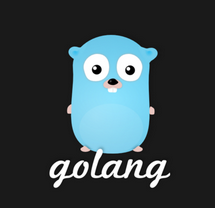

# 
[Go o Golang](https://es.wikipedia.org/wiki/Go_(lenguaje_de_programaci%C3%B3n)) es un lenguaje de programación concurrente y compilado inspirado en la sintaxis de C, que intenta ser dinámico como Python y con el rendimiento de C o C++ desarrollado por Google, sus creadores son Robert Griesemer, [Rob Pike](https://es.wikipedia.org/wiki/Rob_Pike) y [Ken Thompson](https://es.wikipedia.org/wiki/Ken_Thompson) (UNIX).
Su desarrollo empezó en 2007 y la primera versión se liberó en 2009.

* [Hello world](https://play.golang.org/p/NHqaVpKdi-f)

* [Tour of Go](https://tour.golang.org/list)

* [Effective Go](https://golang.org/doc/effective_go) 

## Características principales
---
* Concurrente
* Linkado estático
* Cross compilation
* Multiparadigma
* Tipado estático - tipificación dinámica de datos en tiempo de ejecución
* Garbage collector(latency-free)
* Eficiente  
* High speed compilation
* No utiliza excepciones
* No existen clases sino structs
* Tiene punteros, pero no tiene aritmética de punteros
* Implementación de interfaces implícita 

 
## PROS - CONTRAS
---
***Pros***
* Rápido - eficiente
* Cross compilation
* Recurrente nativo
* Fácil de usar y entender
* Librería estándar completa

***Contras***
* Gestión de dependencias
* No admite sobrecarga de métodos
* No permite mockear depencias de saque
* Carece de [genéricos](images/generics.png)
 

## ¿Quién lo usa?
---
* [Empresas que usan Go](https://github.com/golang/go/wiki/GoUsers)
* Docker
* Kubernetes
* Graphana
* Netflix
* Dropbox
* ...

## Encuestas
---

* [Encuesta StackOverflow](https://insights.stackoverflow.com/survey/2020)
* [Encuesta Jetbrains devecosystem 2020](https://www.jetbrains.com/lp/devecosystem-2020/)
* [JetBrains The state of Go](https://blog.jetbrains.com/go/2021/02/03/the-state-of-go/)

 
 
## Sintaxis
---

* [Sintaxis básica](examples/basics/variables/main.go)
* [Funciones](examples/basics/functions/main.go)
* [Structs](examples/basics/structs/main.go)
* [Composición](examples/basics/composition/main.go)
* [Interfaces](examples/basics/interface/main.go)
* [Goroutines](examples/basics/goroutines/main.go)
* [Test](examples/basics/test/README.MD)
* [Server](examples/ws-sin-framework/main.go)
* [Server con framework](examples/ws-con-framework/main.go)

## Ejemplos
---
* [Organizador de ficheros](https://github.com/dipaso50/toc)
* [Web Services Rest JWT](https://github.com/dipaso50/ws-jwt-go)
* [Más ejemplos, herramientas y librerías](https://github.com/avelino/awesome-go)

## Enlaces de interés
---
* https://github.com/golang/go/wiki 
* https://play.golang.org/
* https://en.wikipedia.org/wiki/Robert_Griesemer
* https://es.wikipedia.org/wiki/Rob_Pike
* https://es.wikipedia.org/wiki/Ken_Thompson

* https://docs.microsoft.com/es-es/dotnet/csharp/programming-guide/generics/

* https://github.com/adonovan/gopl.io/
* https://www.alexedwards.net/blog/an-overview-of-go-tooling
* https://docs.microsoft.com/es-es/azure/developer/go/
* https://github.com/azure-samples/azure-sdk-for-go-samples

 