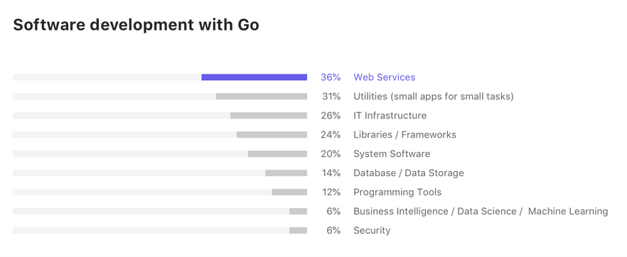

# GOLANG 
  
  
  
  
  
  

## Historia
---

 
* Creadores Robert Griesemer, Rob Pike y Ken Thompson (UNIX)
* Su desarrollo empezó en 2007 y la primera versión se liberó en 2009

  
  
  
  
  
  

## ¿Quién lo usa y porqué? 
---
* https://github.com/golang/go/wiki/GoUsers
* https://blog.jetbrains.com/go/2021/02/03/the-state-of-go/

  
  
  
  
  
  
 

## Características principales
---
* Concurrente
* Compilado-linkado estático
* Cross compilation
* Multiparadigma
* Tipado estático - tipificación dinámica de datos
* Garbage collector(latency-free)
* Eficiente  
* High speed compilation
* No utiliza excepciones
* No existen clases sino structs
* Tiene punteros, pero no tiene aritmética de punteros
* Implementación de interfaces implícita 

 

## PROS - CONTRAS
---
***Pros***
* Rápido - eficiente
* Cross compilation
* Recurrente nativo
* Fácil de usar y entender
* Librería estándar completa

***Contras***
* Carece de genéricos 
  

* Gestión de dependencias
* No admite sobrecarga de métodos

## Más información
---
* https://github.com/golang/go/wiki
* https://awesome-go.com/

## Enlaces de interés
---

* https://play.golang.org/
* https://en.wikipedia.org/wiki/Robert_Griesemer
* https://es.wikipedia.org/wiki/Rob_Pike
* https://es.wikipedia.org/wiki/Ken_Thompson

* https://docs.microsoft.com/es-es/dotnet/csharp/programming-guide/generics/

 