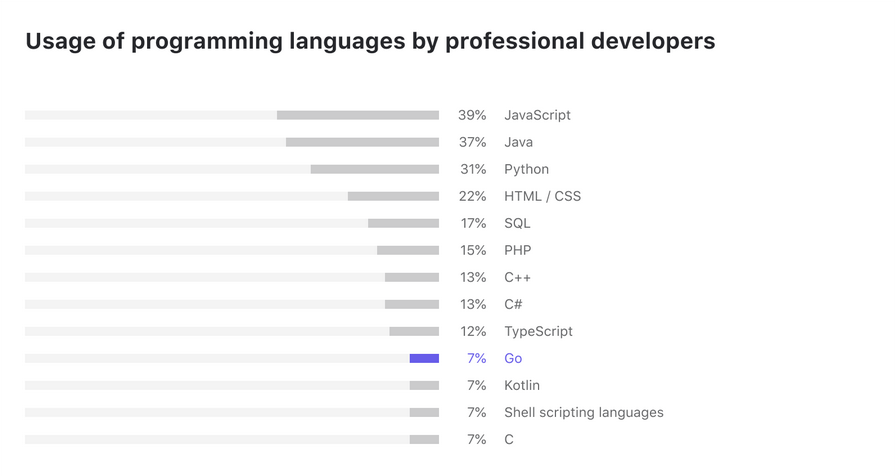
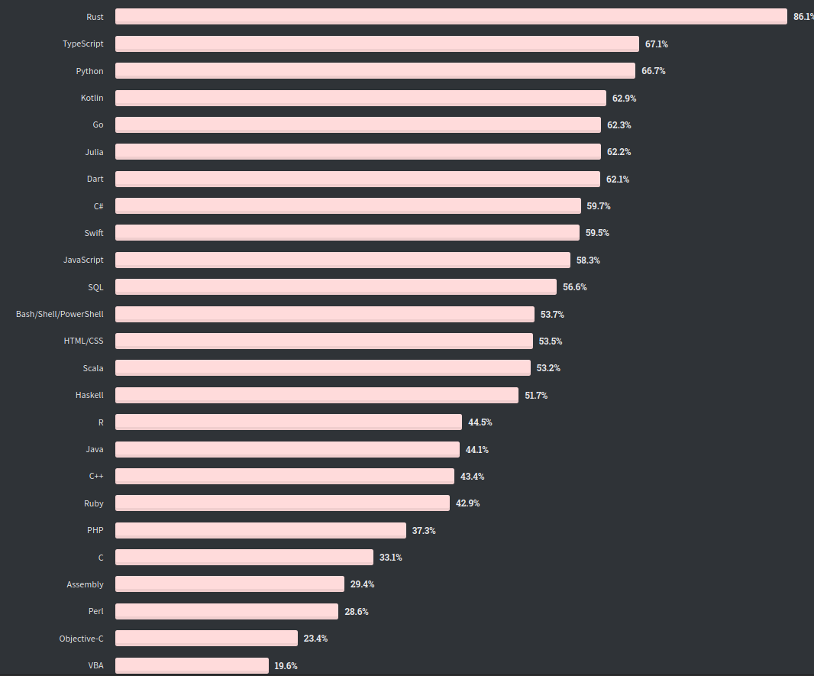
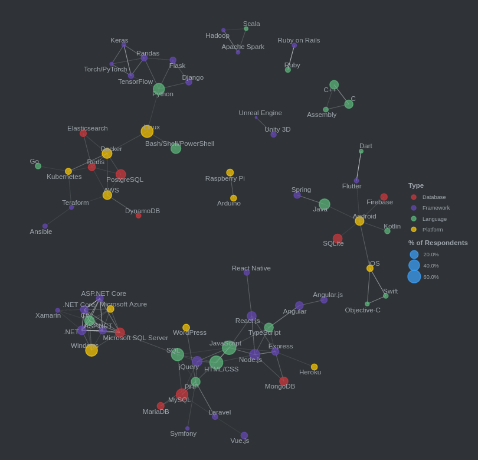

# 
Go es un lenguaje de programación concurrente y compilado inspirado en la sintaxis de C, que intenta ser dinámico como Python y con el rendimiento de C o C++ desarrollado por Google.
  
  
   

## Historia
---

 
* Creadores Robert Griesemer, Rob Pike y Ken Thompson (UNIX)
* Su desarrollo empezó en 2007 y la primera versión se liberó en 2009

  
  
  
  
  
  

## ¿Quién lo usa y porqué? 
---
* [Empresas que usan Go](https://github.com/golang/go/wiki/GoUsers)
* [JetBrains The state of Go](https://blog.jetbrains.com/go/2021/02/03/the-state-of-go/)
* [Jetbrains devecosystem 2020](https://www.jetbrains.com/lp/devecosystem-2020/)

* [Encuesta StackOverflow](https://insights.stackoverflow.com/survey/2020)

 
 

* Docker
* Kubernetes
* Graphana
* Netflix
* Dropbox
* ...

 
 
 

  
 
 
Uso
 

 
Salarios
 

 
Most Loved
 

 
Correlaciones
 

  
  
  
  
  
  
 

## Características principales
---
* Concurrente
* Compilado-linkado estático
* Cross compilation
* Multiparadigma
* Tipado estático - tipificación dinámica de datos
* Garbage collector(latency-free)
* Eficiente  
* High speed compilation
* No utiliza excepciones
* No existen clases sino structs
* Tiene punteros, pero no tiene aritmética de punteros
* Implementación de interfaces implícita 

 

## PROS - CONTRAS
---
***Pros***
* Rápido - eficiente
* Cross compilation
* Recurrente nativo
* Fácil de usar y entender
* Librería estándar completa

***Contras***
* Gestión de dependencias
* No admite sobrecarga de métodos
* Carece de genéricos 
  

## Más información
---
* https://github.com/golang/go/wiki
* https://awesome-go.com/

## Enlaces de interés
---

* https://play.golang.org/
* https://en.wikipedia.org/wiki/Robert_Griesemer
* https://es.wikipedia.org/wiki/Rob_Pike
* https://es.wikipedia.org/wiki/Ken_Thompson

* https://docs.microsoft.com/es-es/dotnet/csharp/programming-guide/generics/

* https://github.com/adonovan/gopl.io/

 